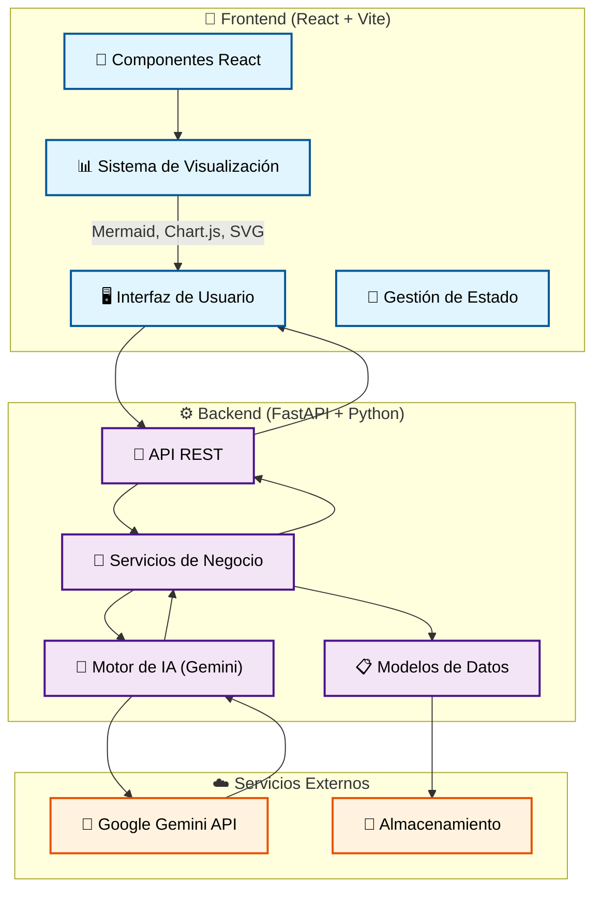
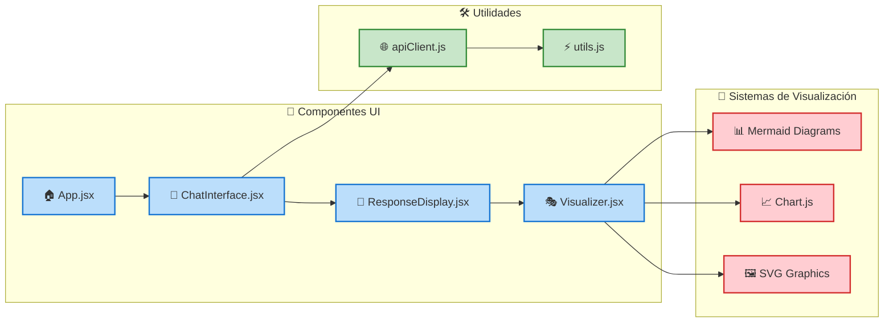
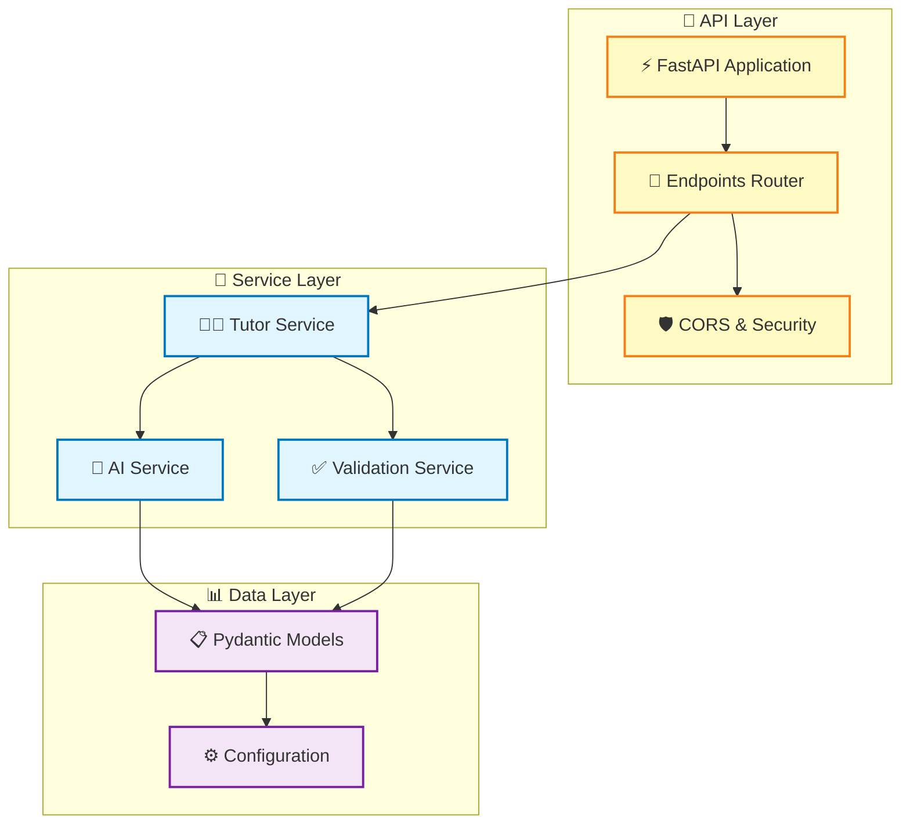
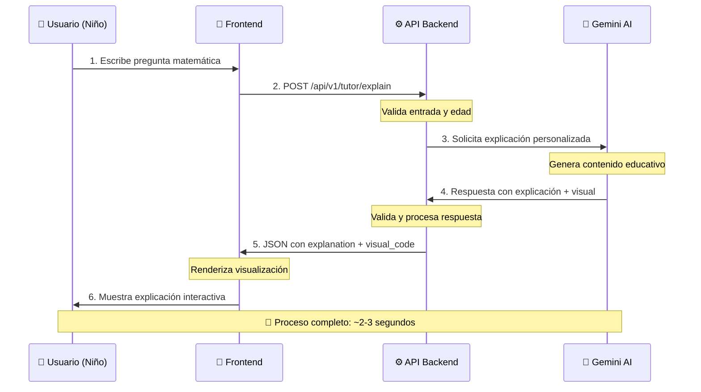
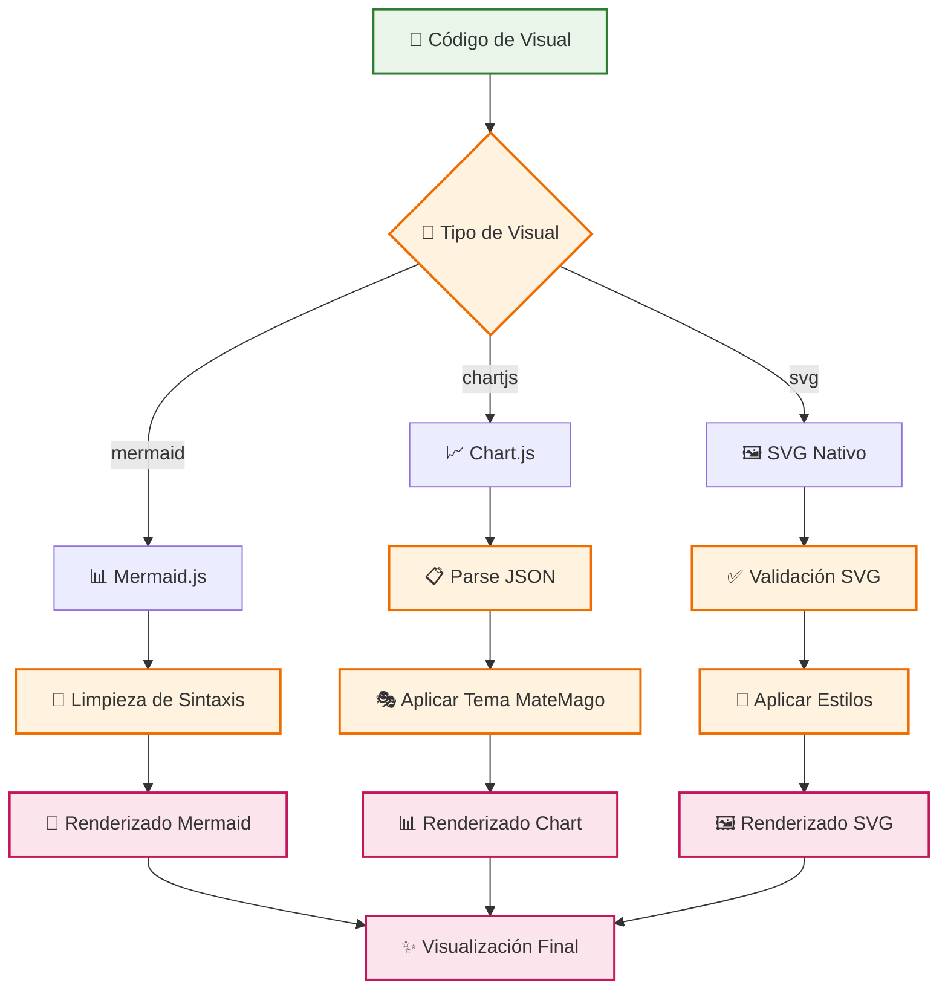
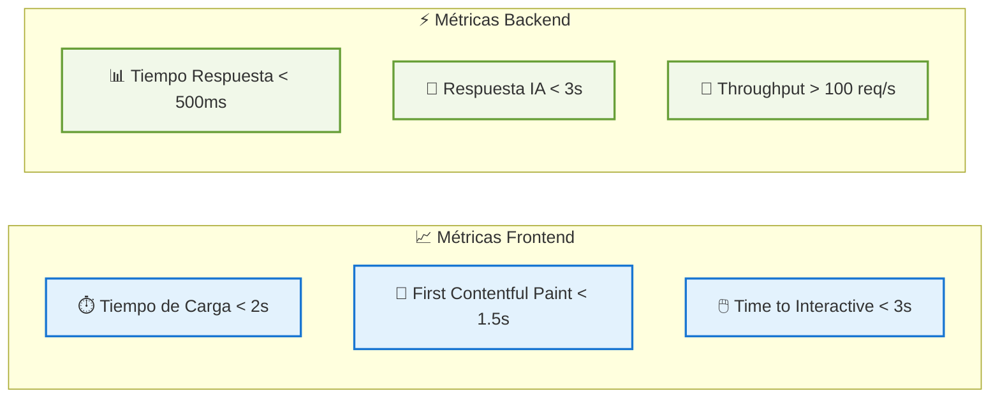

# 🏗️ Arquitectura de MateMago

[](https://github.com/yourusername/MatemagoAgent/issues)
[](https://github.com/yourusername/MatemagoAgent/blob/main/LICENSE)
[](https://github.com/yourusername/MatemagoAgent/stargazers)

## 🎯 Visión General

MateMago es una plataforma educativa que utiliza inteligencia artificial para enseñar matemáticas a niños de 5 a 10 años de manera visual e interactiva. La arquitectura está diseñada para ser escalable, mantenible y fácil de desplegar.

## 🏛️ Diagrama de Arquitectura del Sistema



## 🏗️ Arquitectura Detallada por Capas

### 📱 Frontend - Capa de Presentación



### ⚙️ Backend - Capa de Lógica de Negocio



## 🔄 Flujo de Datos Principal



## 🎨 Sistema de Visualización



## 📦 Estructura de Directorios

```
MatemagoAgent/
├── 📁 frontend/                 # Aplicación React
│   ├── 📁 src/
│   │   ├── 📁 components/       # Componentes reutilizables
│   │   ├── 📁 services/         # Clientes API
│   │   └── 📁 styles/           # Estilos Tailwind
│   ├── 📄 package.json
│   └── 📄 vite.config.js
├── 📁 backend/                  # API FastAPI
│   ├── 📁 app/
│   │   ├── 📁 api/              # Endpoints
│   │   ├── 📁 core/             # Servicios principales
│   │   ├── 📁 models/           # Modelos de datos
│   │   └── 📄 main.py
│   └── 📄 requirements.txt
├── 📁 docs/                     # Documentación
└── 📄 README.md
```

## 🚀 Tecnologías Principales

| Categoría | Tecnología | Propósito |
|-----------|------------|----------|
| 🎨 **Frontend** | React 18 + Vite | Framework UI moderno y rápido |
| 🎭 **Estilos** | Tailwind CSS | Sistema de diseño utility-first |
| 📊 **Visualización** | Mermaid.js | Diagramas y mapas conceptuales |
| 📈 **Gráficos** | Chart.js | Gráficos estadísticos interactivos |
| ⚙️ **Backend** | FastAPI + Python | API REST de alto rendimiento |
| 🤖 **IA** | Google Gemini 2.5 | Generación de contenido educativo |
| 🌐 **HTTP** | Axios | Cliente HTTP para comunicación |
| ✅ **Validación** | Pydantic | Validación de datos en Python |

## 📊 Métricas y Rendimiento



## 🔒 Consideraciones de Seguridad

- **🛡️ CORS**: Configurado para permitir solo dominios autorizados
- **🔑 API Keys**: Almacenadas en variables de entorno
- **✅ Validación**: Todas las entradas son validadas con Pydantic
- **🚫 Rate Limiting**: Protección contra abuso de API
- **👶 Contenido Seguro**: Filtros para garantizar contenido apropiado para niños

## 🚀 Enlaces Rápidos

[](../README.md)
[](./API.md)
[](./DEPLOYMENT.md)
[](../frontend/README.md)
[](../backend/)

---

<div align="center">

**🧙‍♂️ MateMago - Haciendo las matemáticas mágicas para los niños**

[](https://github.com/yourusername/MatemagoAgent)
[](https://python.org)
[](https://reactjs.org)

</div>
